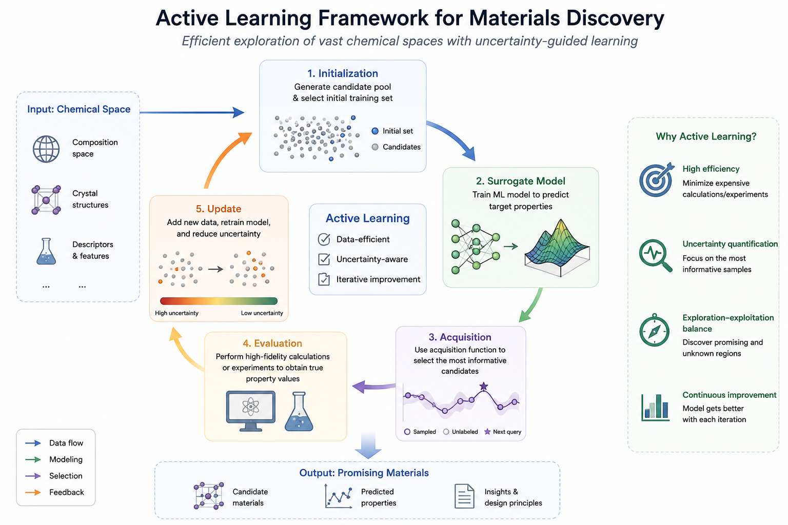

# Active Materials

Active Materials 是一个面向材料筛选的轻量级主动学习工具。它支持两件事：

1. 从 POSCAR、VASP、CIF 等结构文件中提取结构/元素特征。
2. 基于已有标记样本训练模型，并从未标记样本中推荐下一批需要计算或实验验证的材料。



## 项目结构

```text
ActiveMaterials/
  active_materials/
    cli.py             命令行入口
    config.py          配置文件读取与参数管理
    extractor.py       结构文件特征提取入口
    pipeline.py        主动学习主流程
    strategies.py      采样策略
    features.py        表格特征与结构特征拼接
    feature_utils.py   结构/元素特征提取器
  configs/
    example.yaml       示例配置文件
  data/
    seed_features.csv
    total_features.csv
    unlabeled_features.csv
  assets/
    workflow.png
```

## 数据说明

`ActiveMaterials\data` 下的文件对应论文中的数据集：

- `seed_features.csv`：论文中的初始 300 个样本集，也就是 `seed.csv`。该文件包含材料名称、特征列和已知目标值。
- `total_features.csv`：论文中的全部样本特征集，包含所有候选材料的结构/元素特征。
- `unlabeled_features.csv`：未标记样本集，由全部样本去除初始 seed 样本后得到，只包含特征，不包含目标值。

## 安装

在项目根目录执行：

```bash
pip install -e .
```

## 生成结构特征

如果你手里有一批结构文件，例如：

```text
data/structures/
  Ag2Bi2Ca2_186.vasp
  Ag2Cl6K2_161.vasp
  material_001.cif
  POSCAR
```

可以运行：

```bash
active-materials extract-features ^
  --structure-dir data/structures ^
  --output data/total_features.csv
```

如果结构文件在多级子目录中，加入 `--recursive`：

```bash
active-materials extract-features ^
  --structure-dir data/structures ^
  --output data/total_features.csv ^
  --recursive
```

默认会识别：

- `.cif`
- `.vasp`
- `.poscar`
- 文件名为 `POSCAR`
- 文件名为 `CONTCAR`

输出的 CSV 第一列默认为 `formula`，值是结构文件名；后面的列是由 `feature_utils.py` 生成的结构/元素特征。

默认输出论文中使用的固定特征集，即 `formula + 67` 个特征列，列名与 `data/unlabeled_features.csv` 保持一致。这样后续可以直接用于主动学习配置中的数字列索引。

如果希望使用 `FeatureExtract` 自带的自动删列逻辑，可以额外加入 `--all-features`。注意：该模式会根据当前输入数据自动删除零方差或高相关特征，因此不同数据规模下输出列数可能不同。

## 特征筛选 / 降维

生成全量特征后，可以先做特征筛选或降维，再进入主动学习。命令格式为：

```bash
active-materials select-features ^
  --input data/total_features.csv ^
  --output data/total_features_selected.csv ^
  --n-features 20 ^
  --method correlation
```

常用方法：

- `variance`：按方差从大到小选择特征，不需要目标值。
- `correlation`：优先保留方差较大的特征，同时减少高度相关特征，不需要目标值。
- `pca`：主成分降维，不保留原始特征名，不需要目标值。
- `random_forest`：用随机森林重要性选择特征，需要目标列。
- `mutual_info`：用互信息选择特征，需要目标列。

如果使用有监督方法，需要输入包含目标值的 seed 数据：

```bash
active-materials select-features ^
  --input data/seed_features.csv ^
  --output data/seed_features_selected.csv ^
  --n-features 20 ^
  --method random_forest ^
  --target-column ees_kappa ^
  --exclude-columns B
```

输出文件包括：

- 筛选后的 CSV，例如 `data/seed_features_selected.csv`
- 被保留的特征列表，例如 `data/seed_features_selected_selected_features.txt`

推荐流程：

1. 先用 `extract-features` 生成 `total_features.csv`。
2. 对有目标值的 `seed_features.csv` 使用 `random_forest` 或 `mutual_info` 找到重要特征。
3. 用输出的特征列表同步筛选 `unlabeled_features.csv`。
4. 在 `configs/example.yaml` 中把 `feature_columns` 改成筛选后的列名，或者直接使用筛选后的 CSV 运行主动学习。

## 运行主动学习

先检查并修改 `configs/example.yaml` 中的数据路径、特征列、目标列和采样数量，然后运行：

```bash
active-materials run --config configs/example.yaml
```

也可以使用兼容写法：

```bash
active-materials --config configs/example.yaml
```

或者使用 Python 模块方式运行：

```bash
python -m active_materials.cli run --config configs/example.yaml
```

## 配置说明

所有用户输入参数都集中在 `configs/example.yaml` 中，例如：

```yaml
seed_csv: data/seed_features.csv
unlabeled_csv: data/unlabeled_features.csv
output_dir: outputs
sample_id_column: formula
feature_columns: [64, 48, 59, 28, 9, 54]
target_column: ees_kappa
batch_size: 30
test_size: 0.2
strategy: expected_improvement
```

`feature_columns` 可以使用列名，也可以使用从 0 开始的数字列索引。为了复现实验，可以直接使用数字列索引；如果给其他用户使用，推荐改成明确的列名。

## 主动学习流程

一次运行只完成一轮主动学习推荐：

1. 读取 `seed_features.csv`。
2. 根据配置中的 `feature_columns` 和 `target_column` 划分训练集/测试集。
3. 默认使用高斯过程回归模型训练。
4. 读取 `unlabeled_features.csv`。
5. 使用采样策略从未标记样本中选择 `batch_size` 个材料。
6. 输出 `outputs/selected.csv` 和 `outputs/metrics.csv`。

计算或实验完成后，将这一批材料的新目标值追加回 seed 数据，并从 unlabeled 数据中移除，再运行下一轮主动学习。
